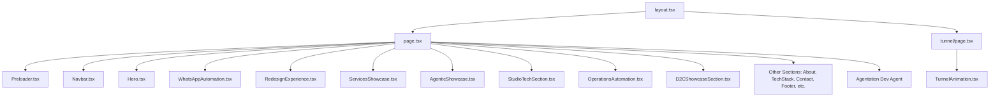

# Universal BRAIN.md - Avhad Enterprises Single Source of Truth

This document serves as the master blueprint and single source of truth for the **Avhad Enterprises** digital platform. It details the system architecture, workflows, state machines, page lifecycles, and component hierarchies. It is designed to allow any future developer or AI agent to instantly understand, maintain, debug, and extend this codebase.

---

## 1. System Mission & Context
Avhad Enterprises is a strategy-led design and technology studio. This codebase represents their public digital ecosystem, featuring a premium web portal with heavy micro-interactions, high-speed Canvas-based 3D animations, GSAP volumetric scroll reveals, and mock automation showcases.

*   **Repository Type**: Next.js App Router (Static Site Generation / SSG).
*   **Aesthetics Target**: Awwwards / FWA-level visual design (dark mode, glassmorphism, responsive grids, canvas shaders, custom cursor variables).
*   **Key Deployment Target**: Fully static compilation (`output: "export"`), making it deployable on global edge networks (Vercel, AWS CloudFront, Cloudflare Pages, Netlify).

---

## 2. Codebase Architecture & File Tree

### File Hierarchy
```
d:/Avhad Enterprises
├── .github/                   # CI/CD Workflows
├── .next/                     # Build artifacts (git-ignored)
├── node_modules/              # Dependencies (git-ignored)
├── public/                    # Static Assets (Images, Icons, Fonts)
├── src/
│   ├── app/                   # App Router Directory
│   │   ├── globals.css        # Core styling, variables, CSS transitions
│   │   ├── layout.tsx         # Global fonts and metadata layout
│   │   ├── page.tsx           # Entry point rendering the portal components
│   │   └── tunnel/
│   │       └── page.tsx       # Separate warp tunnel animation showcase
│   └── components/            # UI Components
│       ├── Navbar.tsx         # Morphing capsule header navigation
│       ├── Preloader.tsx      # Canvas-based 3D warp entry loader
│       ├── Hero.tsx           # Initial view section
│       ├── WhatsAppAutomation.tsx # Mock automation timeline
│       ├── RedesignExperience.tsx # GSAP 3D layout explode and HUD display
│       ├── ServicesShowcase.tsx # Service grids & previews
│       ├── AgenticShowcase.tsx   # Core AI capabilities
│       ├── StudioTechSection.tsx # Digital tools globe display
│       ├── OperationsAutomation.tsx # Interactive Rive workflow automation showcase
│       ├── D2CShowcaseSection.tsx   # E-commerce metrics
│       ├── LogoMarquee.tsx       # Scrolling partner icons
│       ├── Metrics.tsx           # Growth metrics
│       ├── StrategicShowcase.tsx # Scroll wave visual layout
│       ├── About.tsx             # Editorial agency bio
│       ├── WhyChooseUs.tsx       # Value propositions
│       ├── Expertise.tsx         # Functional domains
│       ├── Challenges.tsx        # Customer pain points
│       ├── ProcessTimeline.tsx   # Project phases
│       ├── CaseStudies.tsx       # Client portfolios
│       ├── TechStack.tsx         # Architecture matrices (flipping cards)
│       ├── Industries.tsx        # Vertical segments
│       ├── Testimonials.tsx      # Executive quotes
│       ├── TrustMarquee.tsx      # Trust badges
│       ├── FAQ.tsx               # Interactive accordions
│       ├── Contact.tsx           # Project brief intake form
│       ├── FinalCTA.tsx          # Glowing conversion footer CTA
│       ├── Footer.tsx            # Corporate links
│       ├── TunnelAnimation.tsx   # Interactive WebGL-like 2D Canvas warp
│       │
│       │   ── UNLINKED EXPERIMENTAL COMPONENTS ──
│       ├── BuildFlow.tsx         # Interactive assembly drag/drop (49KB)
│       ├── BusinessEcosystem.tsx # Strategy building workflow (40KB)
│       └── InventoryTrackingSection.tsx # Stock tracking dashboard (12.7KB)
│
├── eslint.config.mjs          # Linting rules
├── next.config.ts             # Compilation overrides (Static Export)
├── package.json               # Dependency definitions
├── tsconfig.json              # TypeScript compilation tokens
├── AGENTS.md                  # Elysian identity configuration
├── Assets.md                  # Design assets and brand standards
├── Workflow.md                # Development workflow pipeline
├── Tech-Stack.md              # Technology requirements checklist
├── Tasks.md                   # System-supported tasks
└── UI-Rules.md                # Visual layout restrictions
```

### Component Structure & Layout Hierarchy


---

## 3. Core Lifecycle & Loading Sequence

The root portal is governed by a strict, two-stage loading sequence designed to control scroll behavior and optimize performance before assets are revealed.

```mermaid
sequenceDiagram
    participant User as Client Browser
    participant P as Preloader (Canvas)
    participant Page as Page Layout
    
    User->>P: Mounts Preloader
    P->>User: Locks scroll (overflow: hidden), resets position to top
    rect rgb(20, 20, 30)
        Note over P: 0ms to 3000ms
        P->>P: Increment progress from 0% to 100%
    end
    rect rgb(10, 30, 40)
        Note over P: Progress reaches 100%
        P->>P: Triggers 3D canvas Warp Animation (3.0 seconds duration)
        P->>P: 0%-20%: Tunnel fades in
        P->>P: 20%-100%: Accelerates camera forward (quinticEase)
        P->>P: 90%-100%: Dissolves and expands exponentially (scale multiplier 1x -> 7x)
    end
    P->>Page: Triggers onComplete() callback
    Page->>User: Sets isRevealed=true, unlocks scroll, triggers entry transitions
    P->>User: Unmounts Preloader (isHidden=true)
```



### Critical Implementation Details
*   **Scroll Intercept**: In `Preloader.tsx`, the scroll is locked by setting `document.body.style.overflow = "hidden"` and executing `window.scrollTo(0, 0)`.
*   **Frame Skip Protection**: In the loading render loop, delta-time calculation is capped to a maximum of 32ms (`Math.min(time - lastTime, 32)`) to avoid layout jumps or visual teleportation on low-refresh rate screens or during heavy CPU spikes.
*   **Perspective Math**: The preloader tunnel utilizes a canvas 2D rendering interface calculating 3D projection:
    $$\text{Scale} = \frac{\text{Focal Length}}{\text{Focal Length} + z - \text{Camera } z}$$
    As $z$ approaches $0$, the scale expands exponentially, creating the illusion of moving forward through a wireframe grid.

---

## 4. Key Interactive Components & Workflows

### 4.1 RedesignExperience (GSAP 3D Volumetric Explode)
*   **Location**: `src/components/RedesignExperience.tsx`
*   **Concept**: Simulates a visual transition from a raw "ordinary" layout wireframe to a premium completed dashboard.
*   **GSAP Timeline Logic**:
    1.  When hovered (`isHovered === true`), the ordinary wireframe layer is animated out: `opacity: 0`, `y: 20` over 0.4s.
    2.  The premium overlay fades in: `opacity: 1` over 0.3s.
    3.  A volumetric explosion along the Z-axis separates layered canvas components:
        *   `plane-back` moves to `translateZ(-25px)`
        *   `plane-middle` stays at `translateZ(0px)`
        *   `plane-front` moves to `translateZ(25px)`
    4.  HUD guide lasers (`scaleZ: 0` to `scaleZ: 1`) connect the layers in 3D space.
*   **Mouse Interaction**: Computes coordinates relative to the bounding box of the card, feeding tilt inputs into a 3D transform style on the card container (`rotateX` and `rotateY`).

### 4.2 WhatsAppAutomation (Mock State Machine)
*   **Location**: `src/components/WhatsAppAutomation.tsx`
*   **Concept**: Simulates an automated chatbot sequence triggering server push alerts when hovered.
*   **Workflow Steps**:
    1.  `Step 1`: AI typing indicator (0ms).
    2.  `Step 2`: AI returns message response options (900ms).
    3.  `Step 3`: Client selects the option: "AI Automation" (2400ms).
    4.  `Step 4`: AI starts typing secondary confirmation (3200ms).
    5.  `Step 5`: AI requests client company name (3900ms).
    6.  `Step 6`: Client types: "ABC Industries" (4700ms).
    7.  `Notifications`: Staggered notifications (Salesforce CRM, Slack alert, Google Calendar event) slide onto the HUD to represent external workflows triggered in the background.

### 4.3 TunnelAnimation (Showcase Page `/tunnel`)
*   **Location**: `src/components/TunnelAnimation.tsx`
*   **Concept**: A configurable space-time warp tunnel canvas widget.
*   **Features**:
    *   *Interactive Theme Engine*: Configures color grids (Cyberpunk, Matrix, Cosmic, Aurora, Monochrome).
    *   *Mathematical Geometries*: Redraws paths dynamically using trigonometric formulas to project circles, hexagons, octagons, triangles, and squares down a Z-axis.
    *   *Bloom & Filter Shaders*: Leverages native 2D canvas shadow blurs and global compositing operations to achieve a high-fidelity glowing vector look.

---

## 5. System Configurations & Compilation Targets

### Next.js Export Configuration
The compilation is configured for **full static output**. In `next.config.ts`:
```typescript
import type { NextConfig } from "next";

const nextConfig: NextConfig = {
  output: "export",
};

export default nextConfig;
```
*   **Implication**: Every route must compile to static assets (`index.html`, `tunnel.html`, and CSS/JS chunks).
*   **Restrictions**: Dynamic Server-Side Rendering (SSR) tools like Next.js `getServerSideProps`, `cookies()`, dynamic headers, middleware rewrites, or default dynamic API routes are **unsupported**.

### Styling Compiler
*   **Compiler**: Tailwind CSS v4.0.
*   **Configuration**: Integrated directly using PostCSS (`postcss.config.mjs` and `@tailwindcss/postcss`). Custom variables are parsed natively via standard CSS variables declared in [globals.css](file:///d:/Avhad%20Enterprises/src/app/globals.css).

---

## 6. Technical Debt, Risks, & Future Optimizations

### Unlinked & Experimental Assets
The codebase contains heavy components that are currently imported but never rendered in the main layout (`page.tsx`):
1.  **`BuildFlow.tsx` (49KB)**: An interactive product drag-and-drop assembly flow.
2.  **`BusinessEcosystem.tsx` (40KB)**: A visual canvas interface depicting business transformation structures.
3.  **`InventoryTrackingSection.tsx` (12.7KB)**: An e-commerce stock dashboard widget.

*   *Risk*: These unlinked components increase build times, add dead weight to the repository, and could compile into client bundles if imported dynamically.
*   *Action*: Either integrate them into sub-pages, establish clean route directories for them, or delete them if deprecation is finalized.

### Performance Bottlenecks
*   **Canvas Garbage Collection**: The Preloader and Tunnel animations create rendering loops using `requestAnimationFrame`. If the component unmounts but does not successfully call `cancelAnimationFrame` or clear interval timers, memory leaks will degrade performance.
*   **Scroll Intercept Observer**: The page utilizes a layout intersection observer to trigger scroll-fades (`.reveal-fade-up`). Heavy DOM layouts with layout-shifting styling elements can trigger rendering jank if GPU-acceleration isn't applied (e.g. `will-change: transform`).
*   **Custom Cursor Variable Updates**: The client captures mouse moves globally:
    ```typescript
    document.documentElement.style.setProperty("--mouse-x", `${e.clientX}px`);
    ```
    Updating CSS properties on the root node (`document.documentElement`) at 60Hz+ triggers continuous style recalculations. If performance drops, this should be throttled or refactored to apply coordinate styles directly onto the target tracking elements.
